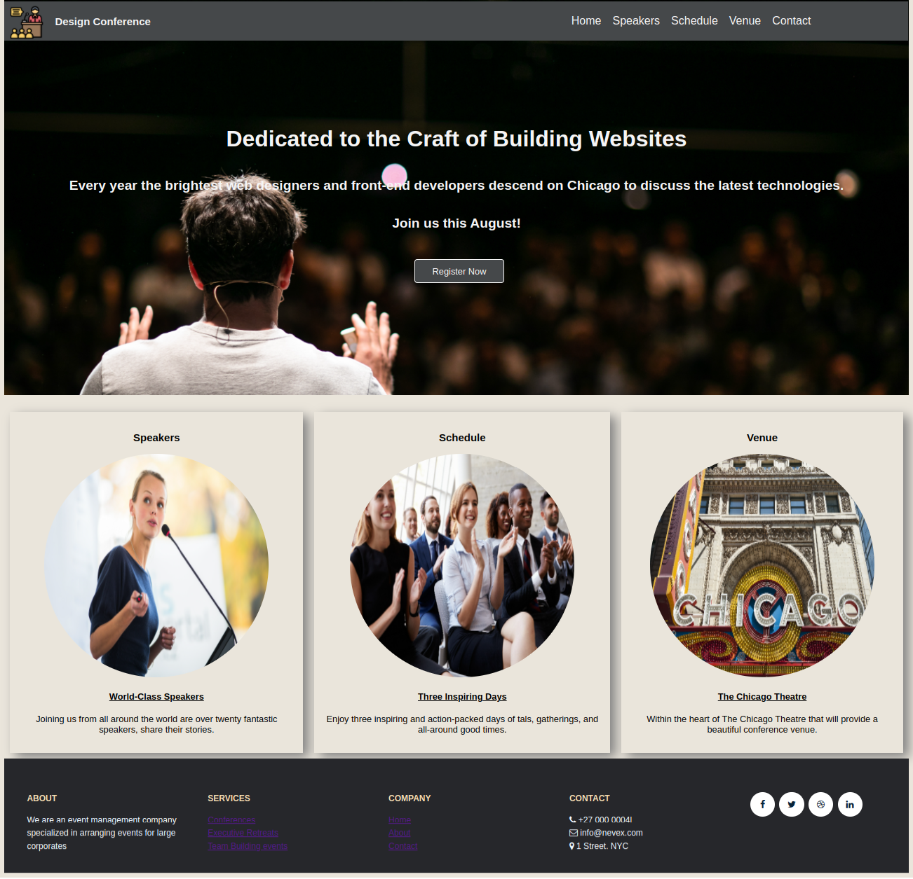
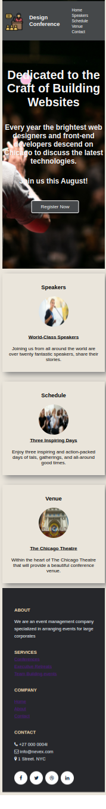

# Develop a responsive web page for an event management company

## Context

The Online Design Conference is a two-day event that is conducted by an event management company. The conference is designed for web developers, web designers, and marketing professionals who want to learn about the latest design trends and strategies. The conference features keynote speeches, panel discussions, and workshops.

As a front end developer, you need to build a responsive web page which has multiple sections to display their various activities.

### Problem Statement

Create a responsive web page for an event management company so that the users can use it on a mobile or desktop device.​ The web page should resemble the images as shown below.

**Desktop View**

**Mobile View**

### Tasks
- The web page contains four sections:​
    - Section 1: Header with a nav bar​
    - Section 2: Single column Hero Unit which occupies full width ​
    - Section 3: Main section with three columns​
    - Section 4: Footer with social media links​
- The HTML code for the page design is provided in the `index.html` file.​
- The style properties should be defined in `style.css` located in the css folder of the boilerplate.​
- All required images are available in the `images` folder.
- Use the flex layout for the header and main sections.​
- Use the grid layout for the footer.

### Define Styles Using Flex and Grid Layout 
- Section 1: Header with a nav bar​
    - The layout for the header should be styled using the flex property.​
    - All the menu items inside the fixed header must be links.​
- Section 2: Single column Hero Unit
    - The hero unit should extend the entire width of the page and must have a background image, a header section with text content and a button.​
    - Use background shorthand property to give color, image, repeat, attachment and position properties. Use background-size property to set the background image size.
- Section 3: Main section
    - The main section should have 3 cards that contain an image and text. Use flex layout to create this section.​
- Section 4: Footer with social media links​
    - The footer should use the grid layout which has a single row and 5 columns.​

**Note**: Use media queries to make the header, hero unit, main section and footer responsive.​

### Details

- Color codes used in this web page are:
    - #45484a (Background-color for Heading, Button )
    - whitesmoke (Heading, menu item, button text)
    - rgb(171, 171, 229) (Mouseover and underline color for menu items)
    - rgb(171, 171, 229) (Button background-color on mouse over)
    - #444 (Heading text color of the Flex container that has cards)
    - rgb(234, 229, 219) (Card background color)
    - Grey (card box-shadow color)
    - Black (Anchor links inside the Flex container that has cards)
    - #26272b (Footer background-color)
    - #737373 (Footer Text color)
    - wheat (Footer heading)
    - aliceblue (Footer content)
    - #072339 (Social media anchor link color)

- Font family used are:
    - "Gill Sans", "Gill Sans MT", Calibri, "Trebuchet MS", sans-serif (Headings and anchor links in headings, buttons, Text in flex container having cards)
    - "Trebuchet MS", "Lucida Sans Unicode", "Lucida Grande", Arial, sans-serif (Headings in hero unit,footer)

